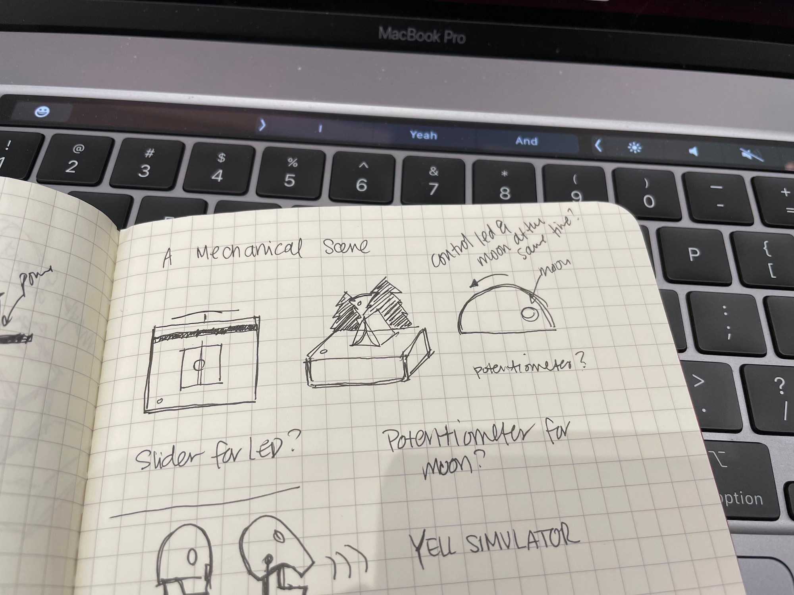
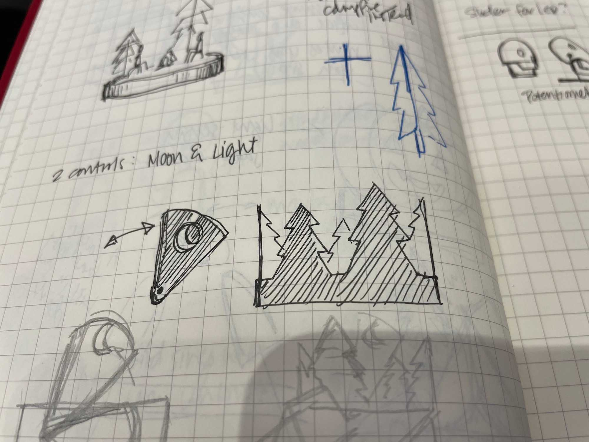
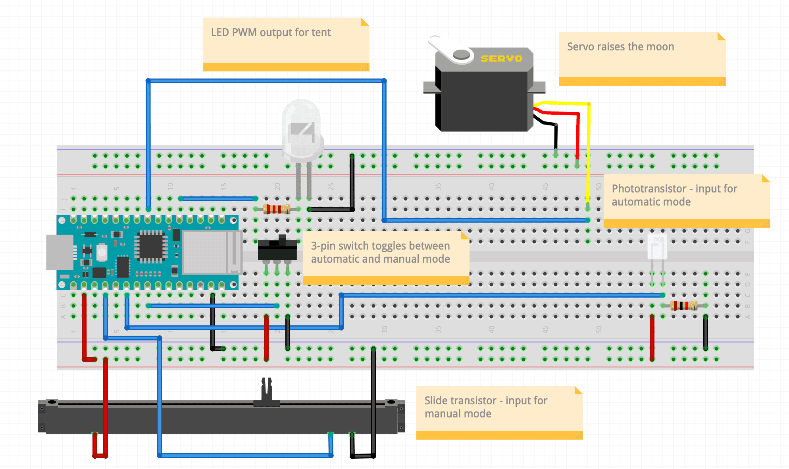
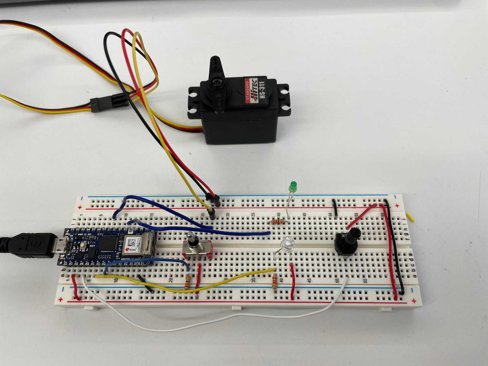

This week, some PWM and starting with servos!

## Servo

This was pretty straightforward. A simple map from analog input to motor output. I found that the motor was chittering, and I had a suspicion that the potentiometer output was a bit noisy. [I found this tutorial to filter potentiometer output](https://www.norwegiancreations.com/2015/10/tutorial-potentiometers-with-arduino-and-filtering/), but there was still plenty of noise in the servo after applying this. Not sure what this was exactly, but definitely something I'd like to work out before using servos and potentiometers together in the future.

`video: [https://youtu.be/6eRpLKSuHto](https://youtu.be/6eRpLKSuHto)`

## Volume

I had a fun time with this, and by fun, I mean awful.

I was able to get my little speaker to work, hooked up to a potentiometer. After some issues (read: I had things plugged in backwards) I was also able to get the amplifier working, though the bump in volume was pretty marginal.

`video: [https://youtu.be/rWaAigbn6lo](https://youtu.be/rWaAigbn6lo)`

However, I had a really interesting issue where anytime the potentiometer went lower than 120 (out of 1024), the entire microcontroller froze. It seemed like it may have short-circuited or something. In the end, I have to restart/reset the microcontroller to get it back to working.

It's not terrible, but there's something going on here that I'd like to understand and avoid in the future.  

## The Interactive Project

 I got a bit of a jump on this last week, with my idea about a little tent that lights up in the dark. I may have been a bit too enthusiastic, because I now realize I need quite a bit more interactivity than I'd planned. Really reinforces the lesson, *Don't solder until you know exactly what you want*. I put in an order for a new Trinket, a few more breadboards, and some more proto boards.

Anyway, I had a little brainstorm, and there are two things I'm now aiming to add to the project:

1. A little moon that rises behind the scene
2. A way to control the moon & LED simultaneously, on demand, besides the phototransistor

The second thing stems from a desire to show off the scene to other people, without having to grab a flashlight or dim the lights in the room. This implies two modes: an automatic light-sensing mode, and a manual user-driven mode. So overall, I'm adding:

- A servo for the moon
- A slide potentiometer, for analog input
- A latching switch, for mode changes

I set up the circuit on a breadboard to test out (with some substitutions with parts I had nearby), and it was mostly successful!

`youtube: [https://youtu.be/x_qZfo1QWig](https://youtu.be/x_qZfo1QWig)`

A couple of surprises or issues:

- The phototransistor output was very noisy, and I ended up with a very "bouncy" servo and LED. This wasn't an issue last week, but then again, I wasn't using a servo either.
- The toggle switch turns "on" the side I don't expect; switching to the right, the left pin is connected.
- There's an interesting experience when switching from automatic to manual mode. Essentially the LED and servo "jump" to wherever the potentiometer is set, which can be a bit jarring and unexpected if the potentiometer was not reset to 0.

A bit more work to do, but definitely on it's way.
