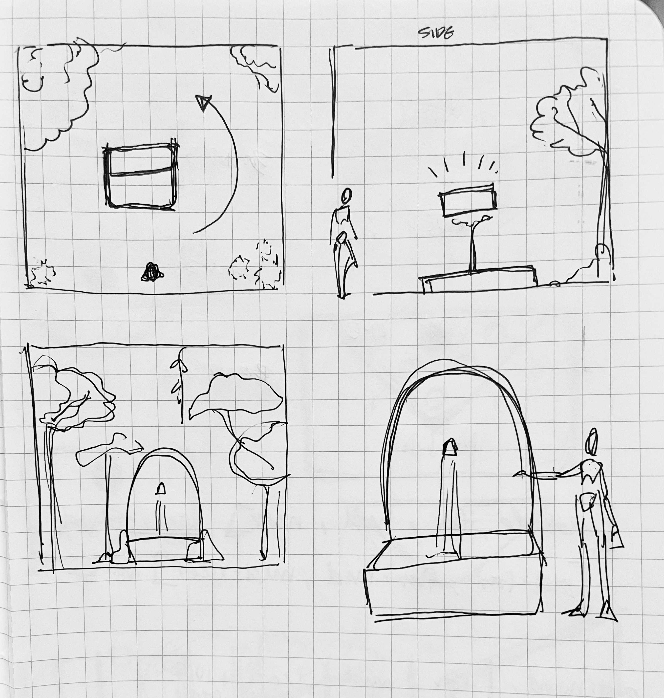
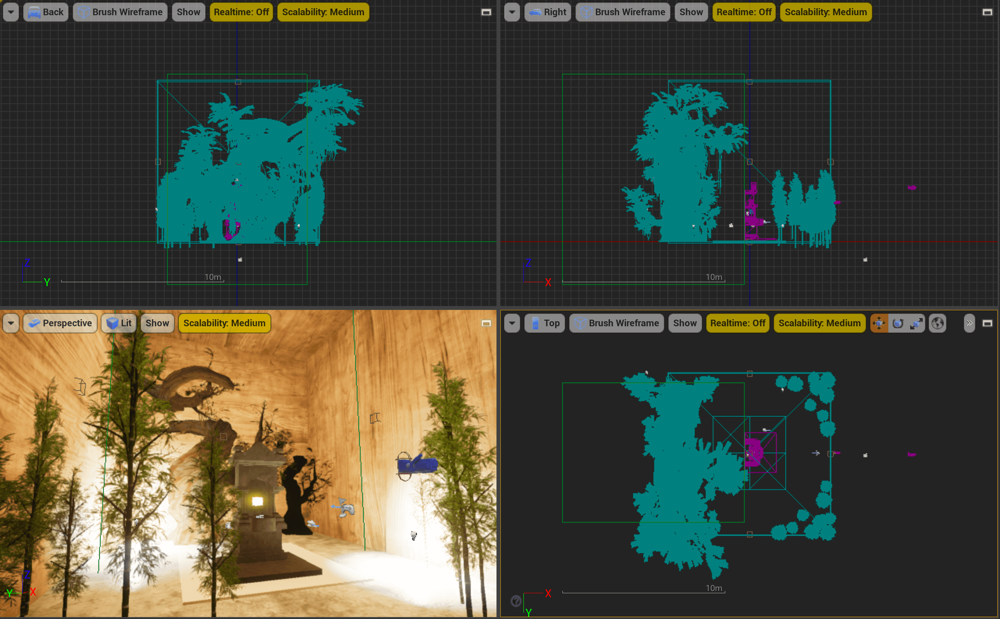
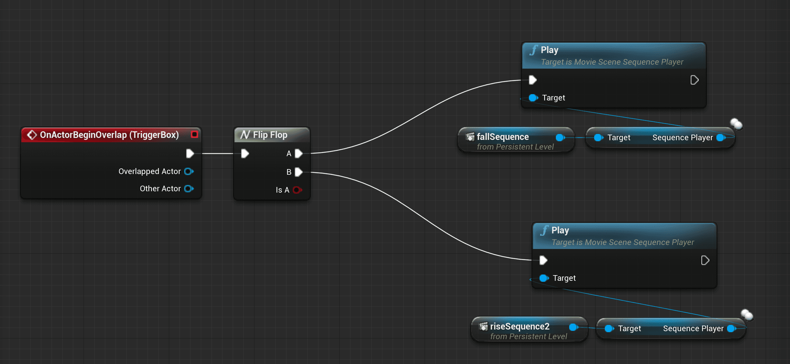
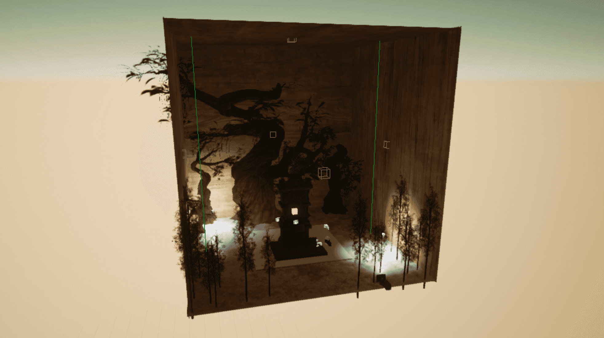
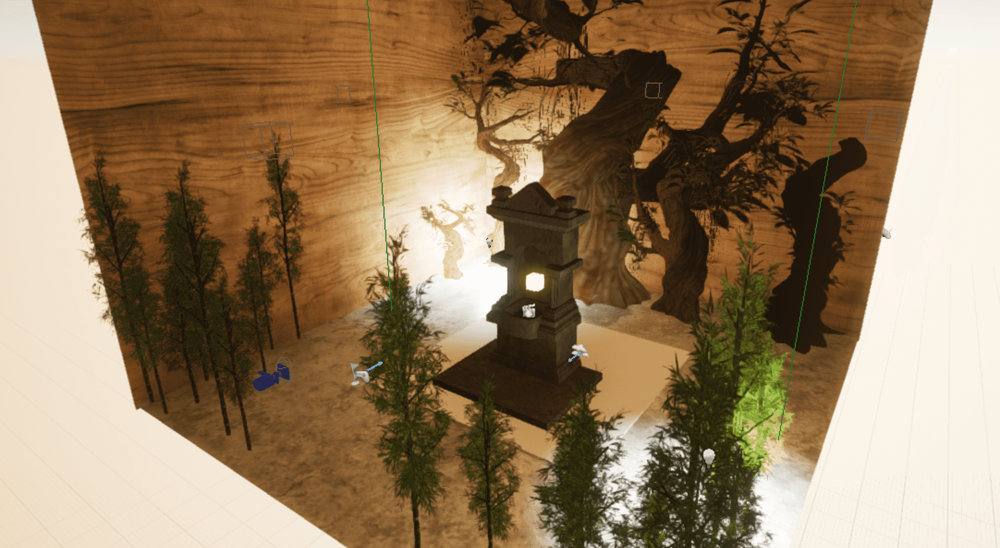
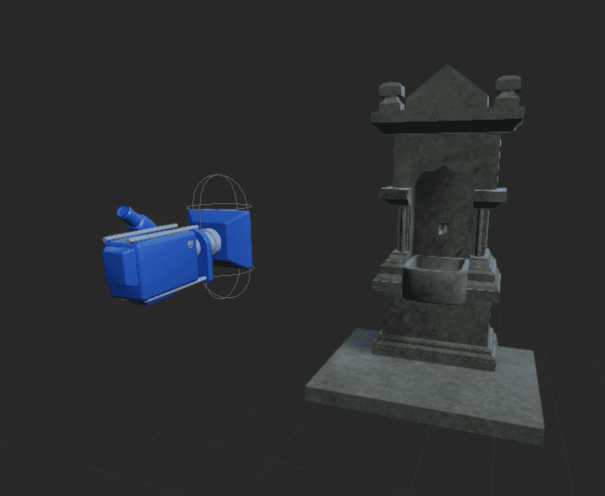
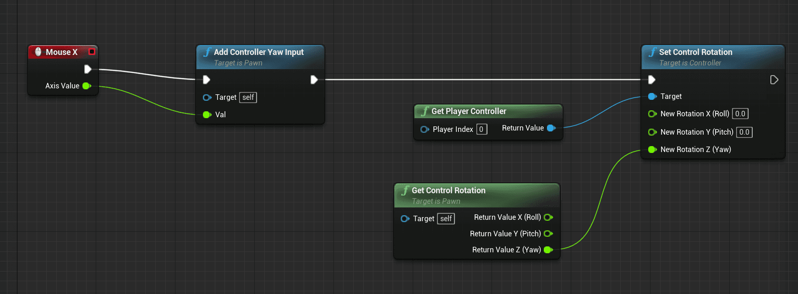
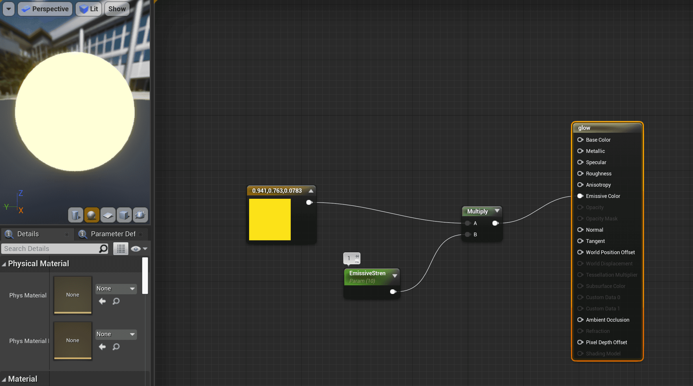

*A test in experience prototyping using Unreal.*

While the majority of my interest lies in the creation of real-world physical installations, it still can be useful to leverage digital tools to create and prototype spatial interactions that may be difficult to realize physically. This final assignment in Hypercinema gave me the time to begin exploring the world of 3D game engines as a way of creating digital mockups.

Using Unreal, I created a simple room to demonstrate the effect of an “impossible” interaction. In this room, a shrine holds a glowing object of interest. When you walk behind that shrine, the object disappears; but the next time you walk around it, it reappears once more.

`youtube: https://youtu.be/6Gql-UUlAy0`

---

## Thinking about Game Engines

I began by asking myself a few questions about game engines. In prototyping for a project, I try to follow the “fail fast and early” ideal. Because of this, any way of making early prototypes cheap, quick, and expressive of the desired interaction is extremely desirable.  

### **What do game engines excel at?**

IE. What might be easier, faster, or more feasible to make in a game engine versus the real world?

- Creating full-scale models for POV experience. Creating a full-scale model is a project intensive both in time and resources; getting space, let alone the time and materials to build enough to express the desired effect may be difficult. Instead, it can be easier to generate that world digitally and place a camera at the intended eye-level, simulating the space instead.
- “Impossible” effects. Many effects (such as making something appear and disappear, or animating a large object) may not technically be impossible, but are physically challenging or time consuming. To create an animatronic in real life takes tremendous skill and effort. To convincingly make something disappear requires large attention to detail and environmental control. These are things that may be done “magically” through digital means instead.

### **What are game engines bad at?**

IE. What is easier to do in real life, or what do game engines have difficulty portraying?

- Tangibility. Currently, no commercial solutions exist for adding convincing tangibility to VR or AR experiences. In order to test something where the guest may have to physically touch, grab, or manipulate an object, it may be better to approach that with physically fabricated prototypes.
- Edge case testing. Game engines are both extremely capable but incredibly limited. Each action that the guest/user may take must by programmed in to the project, and programmed interactions may miss out on unexpected or desired interactions. It’s hard to think of every case, and the guest or user is inherently limited in their possible interactions when using an interface for VR or AR.

---

## Building the Shrine

With these constraints and strengths in mind, I settled on a sample project to execute. I wanted this to be a simple proof of concept for a spacial experience that required a physically difficult effect. In this case, I aimed for the following:

- A room-sized experience with minimal mood setting
- requiring guest spacial tracking
- resulting in an object disappearing and reappearing.

The room is built out of 6 planes, styled with a wooded material. I chose a set of naturalistic materials and objects (trees, bamboo) to place inside the room to give the effect of an unnatural forest; one with clearly natural elements, but in an impossible structure (implying perhaps the inside of a massive tree). To further this mysterious and natural mood, I placed only two point lights in this space, low to the ground and fairly dim. At the center of the space is a marble fountain, within which a glowing cube floats.

The trick of a disappearing object is done through a set of two animations and a box trigger. The trigger is placed to take up the majority of the space behind the fountain/shrine, such that the player triggers the animation to run when behind the fountain. The animation, meanwhile, is extremely simplistic; when triggered, the glowing cube drops through the floor of the world, making it seem to disappear. A flip-flop node ensures that this animation alternates with another one that raises the cube up out of the floor and back into place.  

https://media.giphy.com/media/4arPf8yf114a9Md8Dg/giphy.gif

Overall I consider this a first-try success; this project would have been difficult to execute physically, considering the physical computing/sensor needs and the trick of making the object of interest disappear. While there are quite a few improvements I’d like to make to this scene, I think that it has been effective in communicating the basic experience I set out to create.  

---

## Side notes

### Revolving Cameras

While a camera revolving around an object does not directly simulate the experience of a guest, it does capture a sense of what an object of interest may look like or appear as from all angles. I followed this tutorial on how to attach a camera to a spring arm, and take over the player character. However, I could not manage to get the newly sprung camera to trigger any box or sphere triggers, making it useless for my chosen scenario.

### Glowing Materials

Creating the glowing cube was remarkably easy. I followed this tutorial and created a material with a high emissive value. I’d like to next dynamically generate glowing on objects based on guest position.

