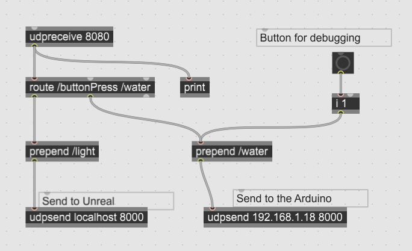
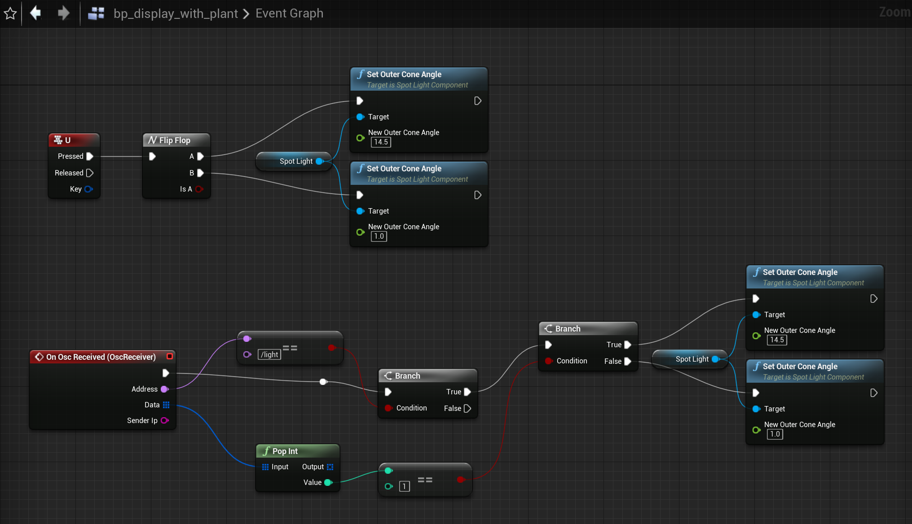
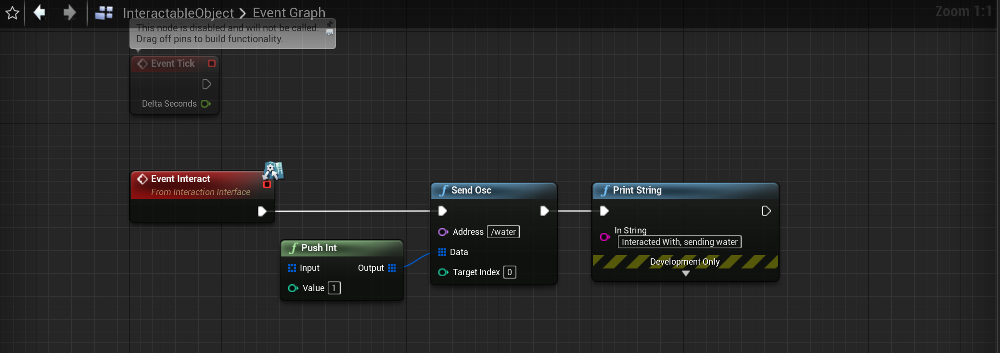
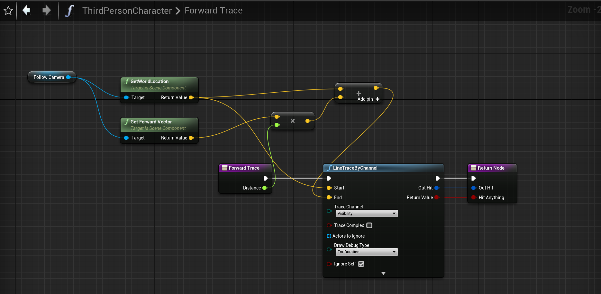
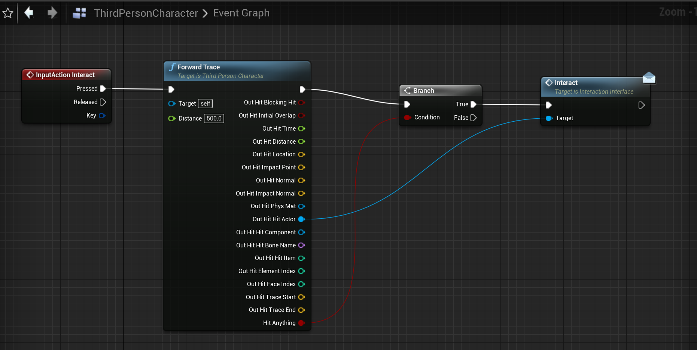
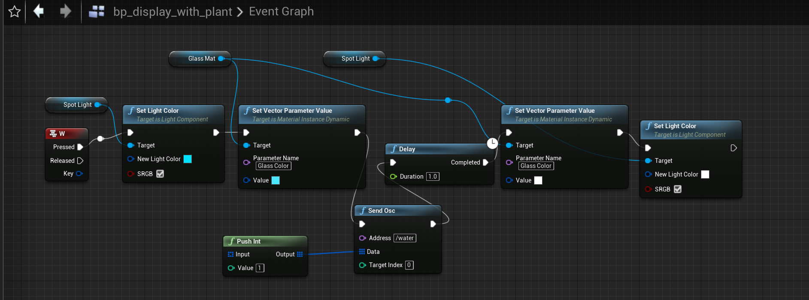

I seem to have a bit of a theme with plants; here's a plant that lives somewhere in between the digital and physical world.

`youtube: https://www.youtube.com/watch?v=JPoUF5xHRXs`

[Arduino code is available on GitHub here.](https://github.com/leils/spring_2022_theme_park_eng/blob/main/unreal_interactive_plant/unreal_plant/unreal_plant.ino)

There are three things happening here:
- Light detection on the physical plant, which turns on a spotlight over the digital plant
- A keypress interaction that "waters" both the digital and physical plant. The digital plant's box turns blue, and the physical plant shakes under the "pouring water".
- A character-object interaction that also generates the physical "pouring water" action. The character has a forward vector trace, and may interact with designated interactable objects with the E keypress.

I started this with just a button press.

`youtube: https://youtu.be/0dxa2UEIV90`

The light-sensitive plant is a [spin in an earlier project of mine](https://www.leiac.me/2021/2021-12-21_bloom-together/), where plants bloomed only when a light was shone at its leaves. Then, we’d used a simple html page to scrub back and forth through the video, and later tried to get it working with Unity.
The connection over OSC was much easier to manage and simpler to put together, versus trying to get everything to communicate over serial.

The “watering” portion of things is where I found the most difficulty. On the physical end is just a servo attached loosely to the end of the plant, twitching back and forth and making the leaves shake.
On the Unreal side was an entirely new set of tools that I was (and still am) unfamiliar with. I first tried to put together an interactable object following [this tutorial](https://www.youtube.com/watch?v=sjrM9vb73MM), which attaches a forward gaze vector to the first person camera. The level I’d chosen to work with had a third person game setup, so I had to tweak that to match. The third person camera was consistently behind the character as well, which meant the forward gaze lines often were blocked by the character mesh.
After I’d done a bunch of work, the setup looked like this:

But then, I couldn’t figure out how to get the interact event to be passed around to other objects in order to change the color of the glass.
I ended up making a separate keypress interaction with the whole plant display in order to both send the OSC message and change the glass color.

*Oops ... I forgot to remove the color-change on the light (where I'd previously used the light instead of glass to indicate watering).*

Finally, I had attempted to make a rain effect by copying over some physics simulation from another project but was so utterly over my head that I set it aside for another day.

---
## Other chores

