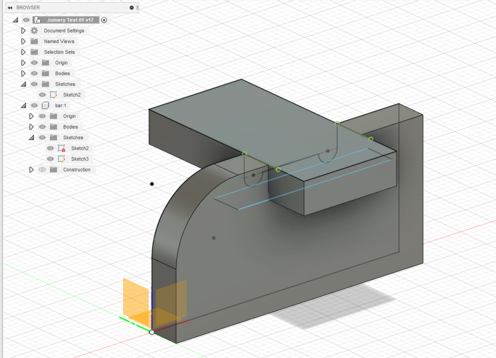
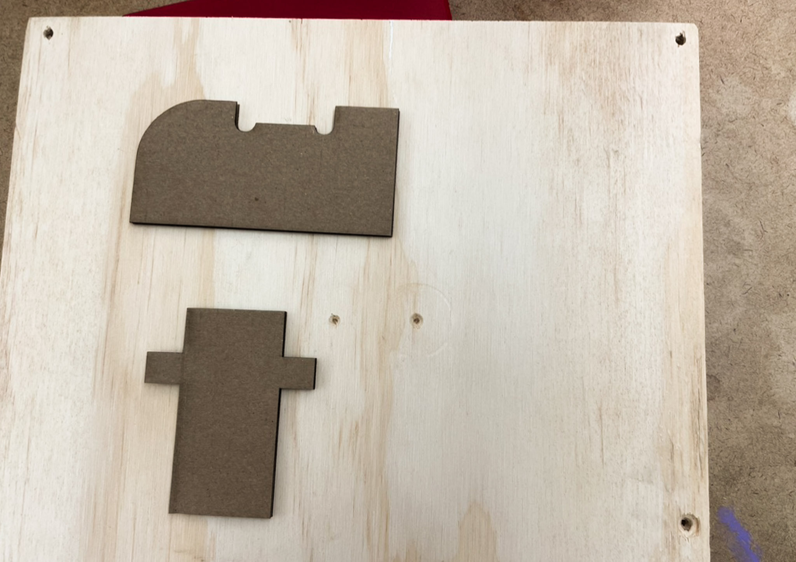
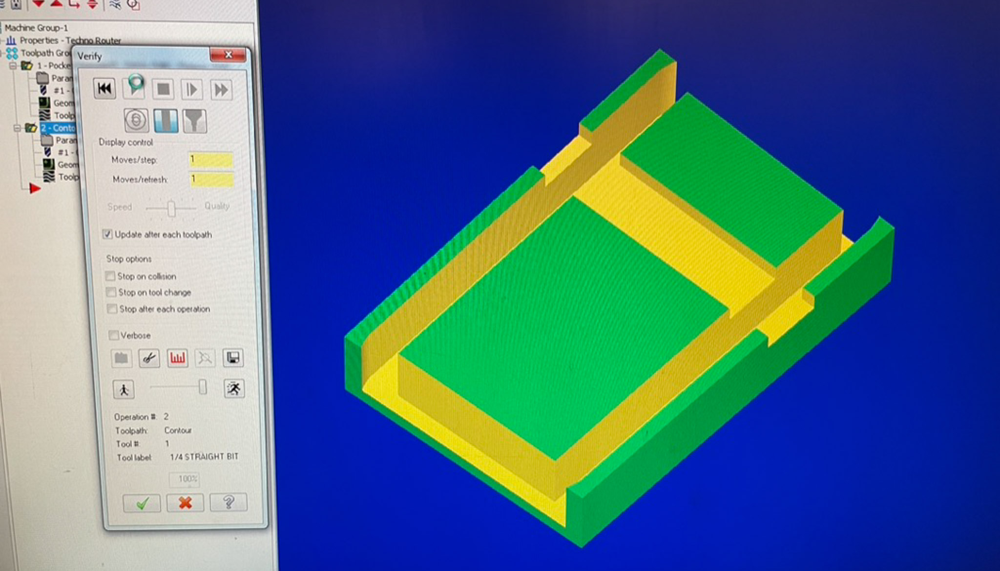
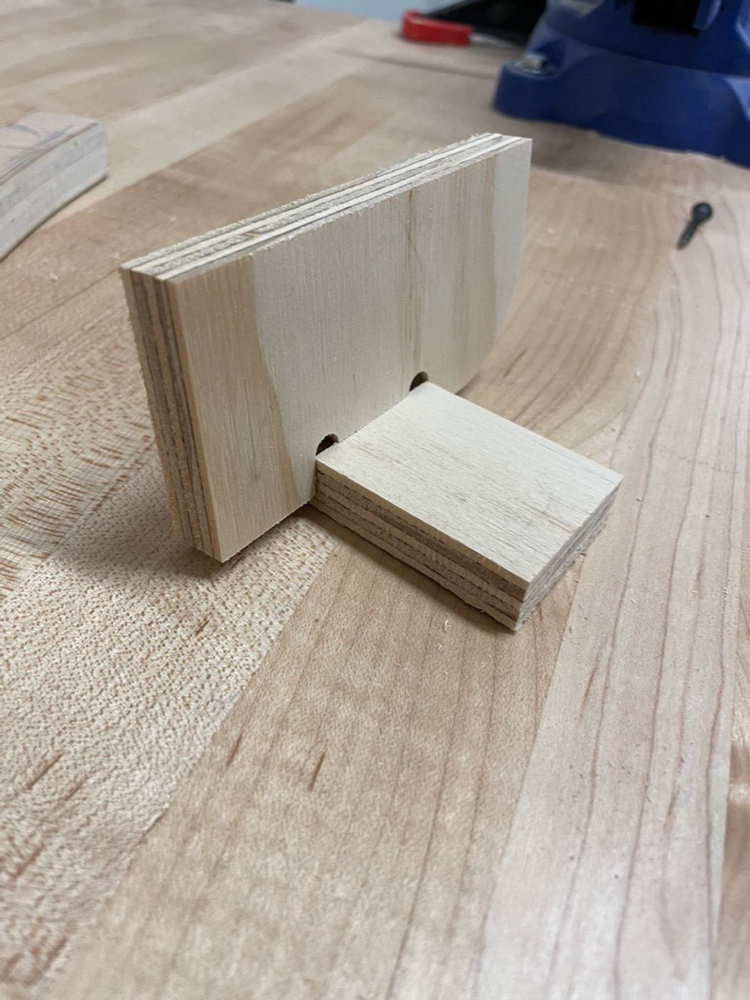
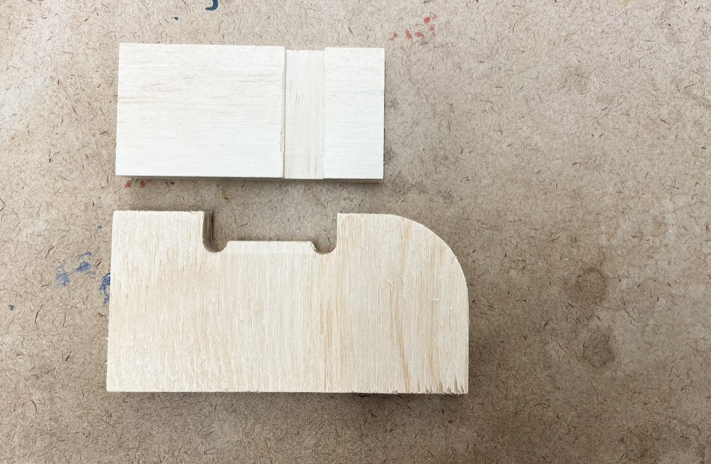
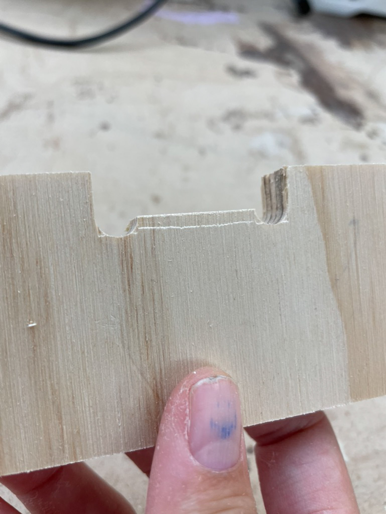
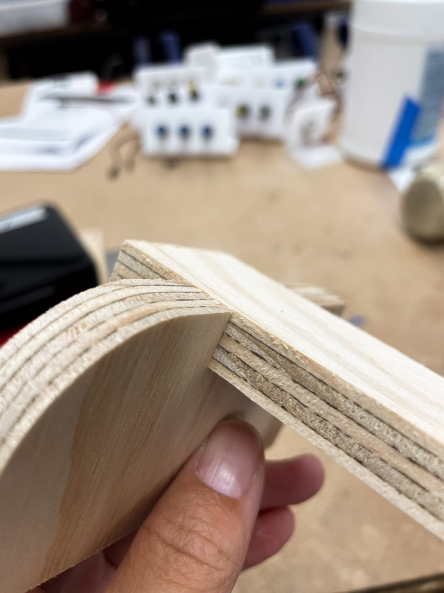
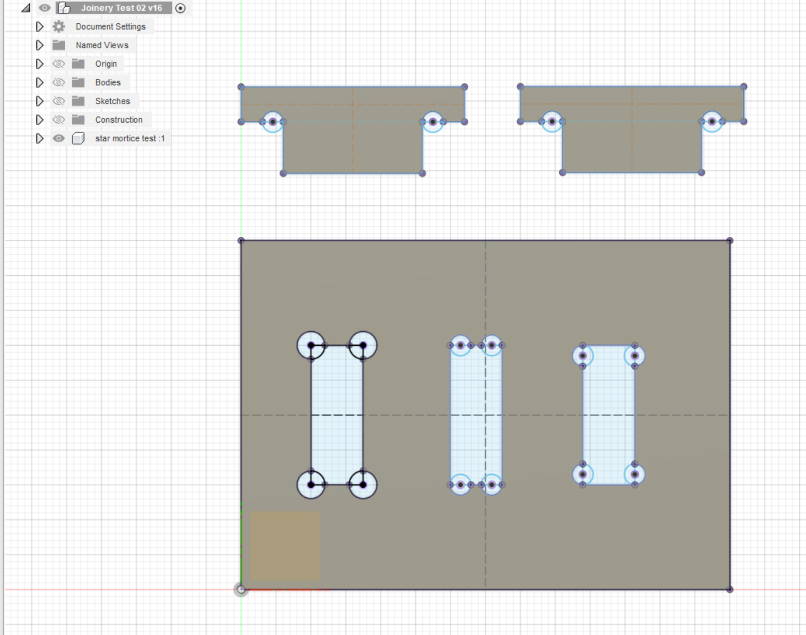
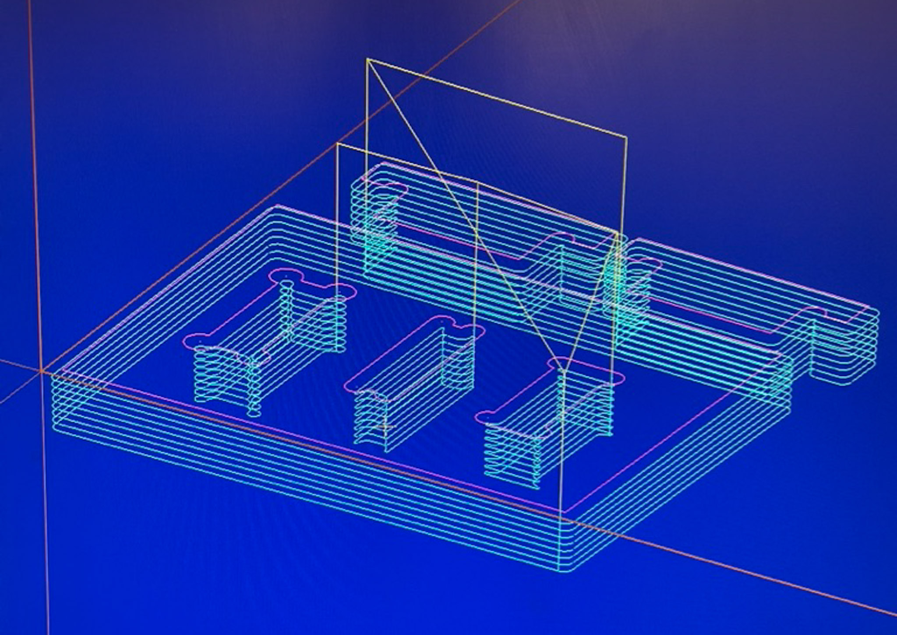
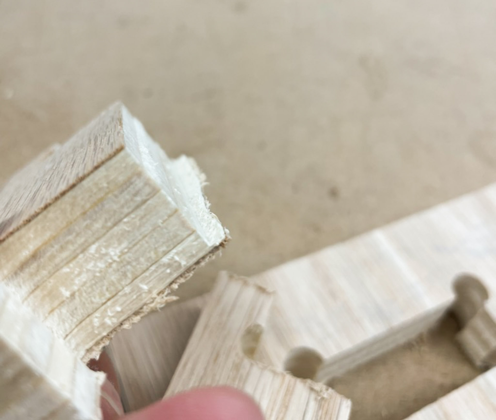

A quick CNC joinery test, in prep for my future side table. I’m inspired by this table:

I decided to test out what the slat-to-base joint. This time I used Fusion360 to model the piece, which let me do some parametric design trickery to allow for easy dimension editing.

I’m not sure what to call this joint, but it’s a bit like a lapped finger tenon. This section includes as slat with a slot cut into it, which fits into a cutout on the vertical piece. I also took the time to cut a template from some cardboard on the laser cutter, which worked great in making sure I was placing the pieces correctly.

I cut this out with a .005” tolerance. It took a bit of hitting with the mallet to fit the pieces together, and when I took them back apart they left indentations on each other. For my preference I think this is slightly too tight. I may step up to .008” tolerance moving forward.

---

I also tried out a few tenons and mortices directly through the face of what will end up being the tabletop. Here I forgot some tolerance along the width of the insert piece, but it still managed to fit with a bit of tapping.

One thing I noticed here is that I placed my cutout pieces a bit close to each other on the raw material. This meant the pieces toward the end got cut out a bit early, and moved on the spoilboard so they missed the last edge of their last pass. Easily fixed in the future, but something to watch out for.
(Note, I failed to get a good picture of this ... I left it on the floor and managed to catch a cold, so it's not available to me as I write this post.)

Onto the real thing.

---

## Tools

- Shopbot CNC
- Epilog laser cutter
- Autodesk Fusion 360
- 5-ply birch plywood

## Takeaways

- Separate the pieces on the raw material so they don’t release early from the board.
- Tolerance is *hard*. But .005-.008 may work well for me.
- I love using the templates to eyeball where my pieces will end up being cut.
- Parametric design makes editing tolerances way easier.
