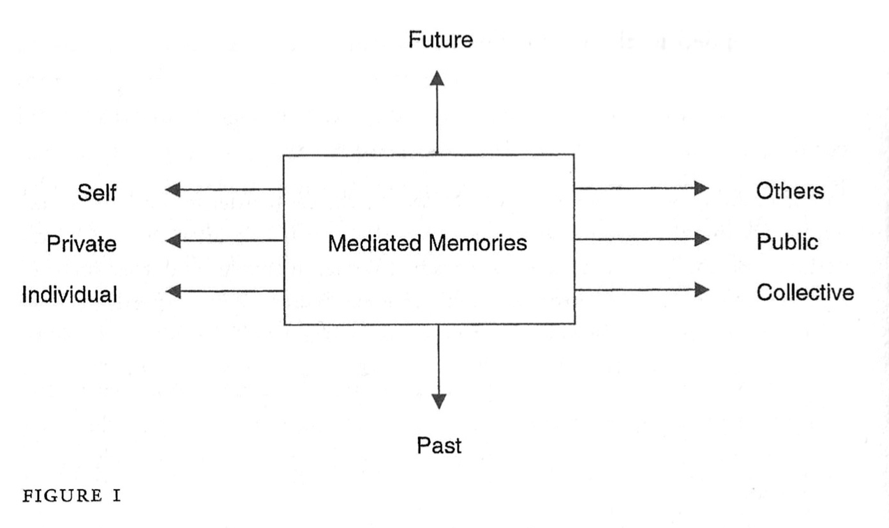

In our heads alone, or in the keepsakes we gather around us? How do these memories age, change, mutate, transform, channel, accumulate, settle? How do the mediums that these memories anchor to do the same? In this week’s readings, I’m left pondering what might be considered “true”, and how the cumulative body of a community might hold onto and cultivate that truth in memory.

### Reflection on [Silent Hero, Alexi Yurenev](https://www.yurenev.com/)

The thing that stands out to me is the searching for “truth”, in both a personal emotional sense and the outright global sense. Although the GAN explorations do not resonate with me, what does is the fact that the only global truth discovered in this project happens through the accumulation of other people; the generation and subsequent exploration of this database, where the artist discovers the fate of a long-lost relative.

### Reflection on [Nostalgia, Svetlana Boym](https://drive.google.com/file/d/1Xb_IIX_lyXNzVBDwcPboAHbB2lP5vKR6/view?usp=sharing) (article)

> While futuristic utopias might be out of fashion, nostalgia itself has a utopian dimension, only it is no longer directed toward the future. Sometimes it is not directed toward the past either, but rather sideways.
>

> The danger of nostalgia is that it tends to confuse the actual home with an imaginary one. In extreme cases, it can create a phantom homeland, for the sake of which one is ready to die or kill. Unelected nostalgia breeds monsters.
>

This quote makes me think of my other current reading; Racial Melancholia and Racial Disassociation. In Racial Melancholia, the subject experiences a separation from their race in such a way that they can never achieve connection, nor never fully let go of this ideal race. Instead, the connection is warped into the desire and longing for an _ideal_ connection that is impossible to create.

I love the idea of defining the difference between restorative and reflective nostalgia; one perhaps more healthy, more realistic.

### Response to  [Mediated Memories in the Digital Age](https://drive.google.com/file/d/15SpDYq8tZhv8QVkiAXPnZR6oWt6RO-bj/view?usp=share_link), José van Dijck (Book excerpt, 11 pages)

The use of media to create or shape memory lends more validity and a new perspective to the Silent Hero exploration in GANs, in my eyes.

This reading makes me think of the keepsakes that I have begin to collect over the years. Once a devout minimalist, I have more recently begun to recon with the sheer amount of objecthood my home encases, and the way that each thing is, from some angle or another, a mediated memory. I wonder how mediated memories can be traded, shared, duplicated, and further spread with a conscious eye turned to the way that they will inevitably mutate.

### Response to [Blood is a Seed (La Sangre Es Una Semilla), Isadora Romero](https://www.worldpressphoto.org/collection/photo-contest/2022/Isadora-Romero/1)

Flora as memory is a fascinating thought that reminds me of the work of my good friend Alice Yuan Zhang. I think often about the way that food acts as an extension of our identities and memory (and by extent, the flora and fauna that we create that food from). I hadn’t thought before of the way that our global farming industry has wiped out entire species of plants and animals, wiping out the memory that lives with it.
